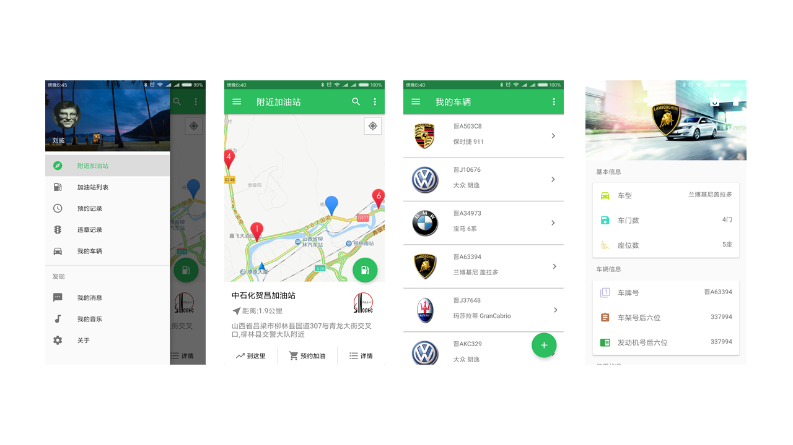

## 车联网Android端App

### 概述
- 本项目是一个2016年在校期间开发的参赛项目，项目通过使用扫描二维码模拟收集车辆传感器数据，以此来提供一系列汽车周边服务，比如获取周边加油站信息，模拟预约加油，手机端管理车主车辆信息等
- 使用原生框架开发了基于Android平台的App，接入了高德地图，实现了实时定位，路径规划等功能，通过接入并解析第三方在线API接口来获取线下加油站真实信息，并实现了通过扫描二维码模拟数据同步等功能
- 项目获得了《山西省第十五届“兴晋挑战杯”大学生课外学术科技作品竞赛》一等奖

### 项目截图
