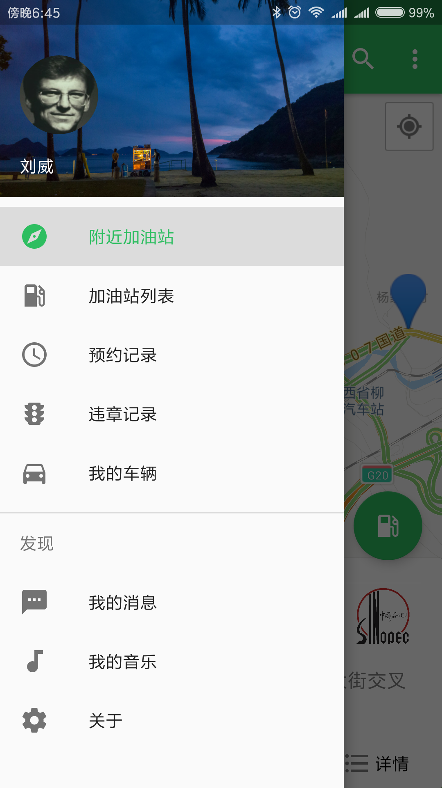
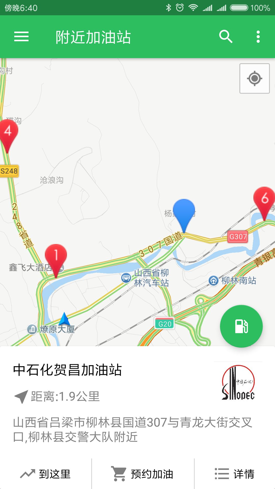
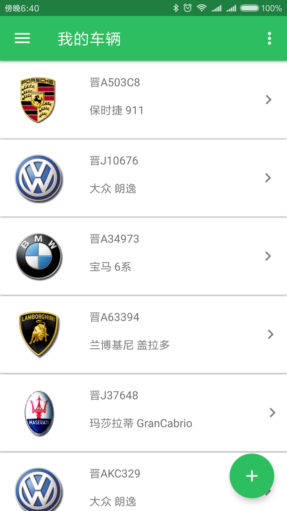

## 车联网Android端App

### 概述
- 本项目是一个在校期间的参赛项目，项目通过使用扫描二维码模拟收集车辆 传感器数据，以此来提供一系列汽车周边服务，比如获取周边加油站信息，模 拟预约加油，手机端管理车主车辆信息等
- 使用原生框架开发了基于 Android 平台的 App，接入了高德地图，实现了实 时定位，路径规划等功能，通过接入并解析第三方在线 API 接口来获取线下 加油站真实信息，并实现了通过扫描二维码模拟数据同步等功能
- 项目获得了《山西省第十五届“兴晋挑战杯”大学生课外学术科技作品竞赛》一等奖

### 项目截图
- {:height="50%" width="50%"}
- {:height="50%" width="50%"}
- {:height="50%" width="50%"}
- {:height="50%" width="50%"}